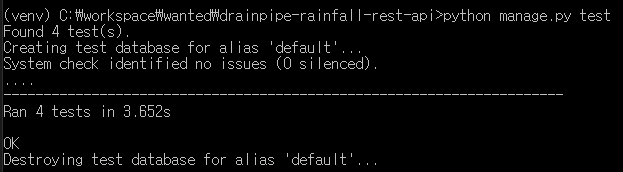

# :umbrella::droplet: Drainpipe Rainfall REST API Service
서울시 하구관 수위, 강우량 현황 정보 데이터를 결합하여 제공하는 서비스

# :bookmark_tabs: 목차
* [개발 기간](#calendar-개발-기간)
* [프로젝트 개요](#books-프로젝트-개요)
    * [프로젝트 설명](#page_facing_up-프로젝트-설명)
    * [프로젝트 요구사항](#clipboard-프로젝트-요구사항)
    * [사용 기술](#hammer-사용-기술)
    * [API Test](#hourglass_flowing_sand-api-test)
    * [프로젝트 분석](#mag_right-프로젝트-분석)
* [API Endpoint](#pushpin-api-endpoint)

# :calendar: 개발 기간
2022.11.07. ~ 2022.11.10.

# :books: 프로젝트 개요
## :page_facing_up: 프로젝트 설명
Open API 방식의 공공 데이터 2종을 수집, 가공하여 REST API 개발

# :clipboard: 프로젝트 요구사항
1. 서울시 하수관로 수위 현황과 강우량 정보 데이터를 결합
2. 출력값 중 GUBN_NAM과 GU_NAME 기준으로 데이터를 결합
3. 데이터는 JSON으로 전달

## :hammer: 사용 기술
* Back-End: Python, Django, Django REST Framework
* Database: SQLite
* ETC: Git, Github, 서울열린데이터 광장 Open API

## :hourglass_flowing_sand: API Test
* 하수관 수위, 강우량 최신 데이터 조회 테스트 코드 작성
* 현 시간까지의 강우량 데이터 조회 테스트 코드 작성
* 현 시간까지의 하수관 수위 데이터 조회 테스트 코드 작성

## :mag_right: 프로젝트 분석
* 현황 데이터 조회 API 개발, DB 모델링 없이 진행
    * 과거 데이터가 필요하다면 모델링 필요
    * batch 작업을 통해 데이터 수집 필요
* Open API 데이터 조회 시 데이터가 시간에 맞게 저장되지 않음 조회 시에 최신 데이터로 수집
* 강우량 Open API
    * 10분 단위로 저장되고 있음
    * 내림차순으로 구성되어 있음
    * 구청에서 관리하는 강우량 개수가 2~3개 정도로 되어 있음
* 하수관 수위 Open API
    * 1분 단위로 저장되고 있음
    * 오름차순으로 구성되어 있음
    * 구마다 하수관의 개수가 다름
* API 결합
    * APi 별로 조회 시 각각 ID(CODE)로 `Set` 하여 데이터 수집
    * 하수관 수위 클래스, 강우량 클래스 두 클래스로 분리하여 데이터 관리
* today API
    * 하수관 수위 데이터 조회는 `/2022110115/2022110116/`일자와 시간 필요
    * 현 시간까지의 조회 `PATH LSIT`를 만들어 놓고 비동기 병렬처리로 데이터 수집
    * 단일 처리보다 `약 6 ~ 8배` 가량 속도 개선

# :pushpin: API Endpoint
|URL|Method|Action|Description|
|:---|:---:|:---:|:---|
|/api/v1/drainpiperainfall/lagest/?gu_name="test구"|GET|List|최신 데이터 조회|
|/api/v1/drainpiperainfall/rainfall/today/?gu_name="test구"&page=1|GET|List|현 시간까지의 강우량 데이터 조회|
|/api/v1/drainpiperainfall/drainpipe/today/?gu_name="test구"&page=1|GET|List|현 시간까지의 하수관 수위 데이터 조회|
